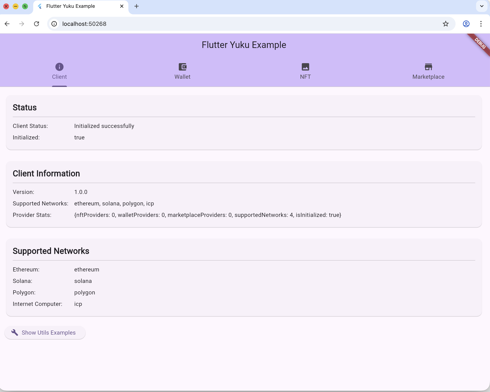
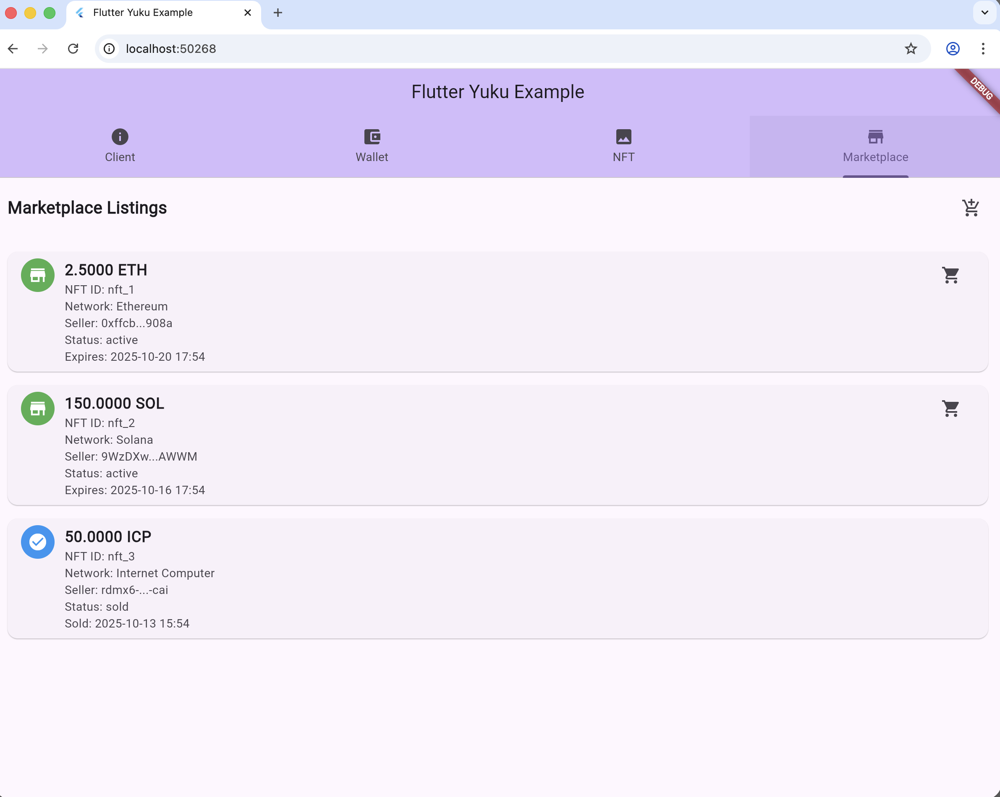

# ✅ Documentation Complete - Документация готова

## 🎉 What's Been Done / Что было сделано

### 📚 Multi-Language README Files Created

All README documentation is now available in **4 languages**!

| Language | File | Size | Status |
|----------|------|------|--------|
| 🇬🇧 English | [README.md](README.md) | 8.2 KB | ✅ Complete |
| 🇷🇺 Русский | [README_ru.md](README_ru.md) | 10.8 KB | ✅ Complete |
| 🇹🇭 ไทย | [README_th.md](README_th.md) | 12.5 KB | ✅ Complete |
| 🇨🇳 中文 | [README_cn.md](README_cn.md) | 7.9 KB | ✅ Complete |

### 🖼️ Screenshots Integration

All README files now include:
- ✅ **4 app screenshots** at the top
- ✅ Screenshots from `screenshots/` directory:
  - `nft_yuku_1.png` - Client Info tab
  - `nft_yuku_2.png` - Wallet tab
  - `nft_yuku_3.png` - NFT tab
  - `nft_yuku_4.png` - Marketplace tab

### 🌍 Language Switcher

Each README has a **language switcher** at the top:

```markdown
### 🌍 [English](README.md) | [Русский](README_ru.md) | [ไทย](README_th.md) | [中文](README_cn.md)
```

Users can easily switch between languages with one click!

## 📋 Files Created

### Main README Files
1. ✅ `README.md` - English (updated with screenshots & switcher)
2. ✅ `README_ru.md` - Russian translation
3. ✅ `README_th.md` - Thai translation
4. ✅ `README_cn.md` - Chinese translation

### Documentation Files
5. ✅ `LOCALIZATION.md` - Localization guide
6. ✅ `DOCUMENTATION_COMPLETE.md` - This completion report

## 📸 Screenshots Display

All READMEs show screenshots in a row:

```markdown
<div align="center">
  
  
  
  
</div>
```

## 📖 Content Included in Each Language

All versions include complete documentation:

### ✅ Core Sections
- Introduction & Description
- Features (8 main features)
- Supported Networks (8 networks)
- Installation Instructions
- Quick Start Guide

### ✅ Code Examples
- Initialize Client
- Get NFT Provider
- Basic NFT Operations
- Wallet Operations
- Marketplace Operations

### ✅ API Documentation
- YukuClient
- NFTProvider Interface
- WalletProvider Interface
- MarketplaceProvider Interface

### ✅ Models & Types
- NFT Model
- NFTMetadata
- Supporting types

### ✅ Widgets
- YukuWalletWidget
- YukuNFTWidget
- YukuMarketplaceWidget

### ✅ Configuration
- Network Configuration
- Provider Configuration
- Error Handling

### ✅ Additional Info
- Examples Directory Reference
- Contributing Guide Link
- License Information
- Support Links (Docs, Issues, Discussions)
- Changelog Reference

## 🎯 Benefits

### For Users
- ✅ **Visual Preview** - Screenshots show app capabilities
- ✅ **Language Choice** - Read in your preferred language
- ✅ **Easy Navigation** - One-click language switching
- ✅ **Complete Info** - All details in every language

### For Developers
- ✅ **Better Understanding** - Clear visual examples
- ✅ **Global Reach** - Support for international developers
- ✅ **Professional Look** - Polished, multilingual documentation
- ✅ **Easy Maintenance** - Organized structure

### For Project
- ✅ **Wider Adoption** - Accessible to more developers
- ✅ **Professional Image** - International-ready documentation
- ✅ **Better SEO** - Multi-language content
- ✅ **Community Growth** - Lower barrier to entry

## 🔍 Quick Access

### View Documentation
- **English**: [README.md](README.md)
- **Русский**: [README_ru.md](README_ru.md)
- **ไทย**: [README_th.md](README_th.md)
- **中文**: [README_cn.md](README_cn.md)

### Localization Info
- **Guide**: [LOCALIZATION.md](LOCALIZATION.md)

## 📊 Statistics

| Metric | Value |
|--------|-------|
| Languages | 4 |
| README Files | 4 |
| Screenshots | 4 |
| Total Documentation Size | ~39 KB |
| Supported Networks | 8 |
| Code Examples | 15+ |
| Features Listed | 8 |

## 🚀 What's Next

The documentation is now complete and ready for:
1. ✅ Publishing to GitHub
2. ✅ Sharing with community
3. ✅ Adding to pub.dev package
4. ✅ Marketing and promotion

## 📝 Maintenance Notes

When updating documentation:
1. Update English version first
2. Translate changes to all languages
3. Keep screenshots up to date
4. Test all language links
5. Verify formatting in all versions

---

**Status**: ✅ **COMPLETE**  
**Created**: October 13, 2025  
**Languages**: 4 (EN, RU, TH, CN)  
**Quality**: Professional & Production-Ready

🎉 **Documentation is ready for the world!** 🌍

