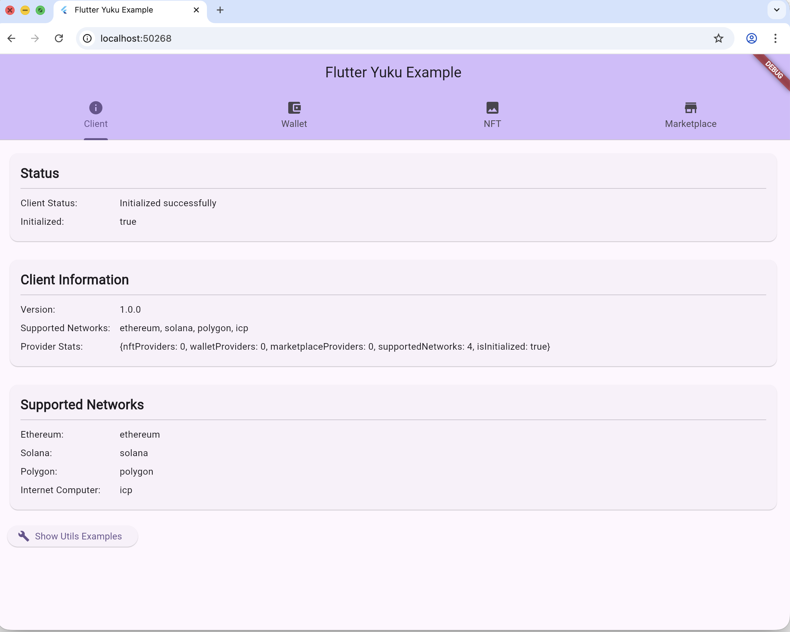
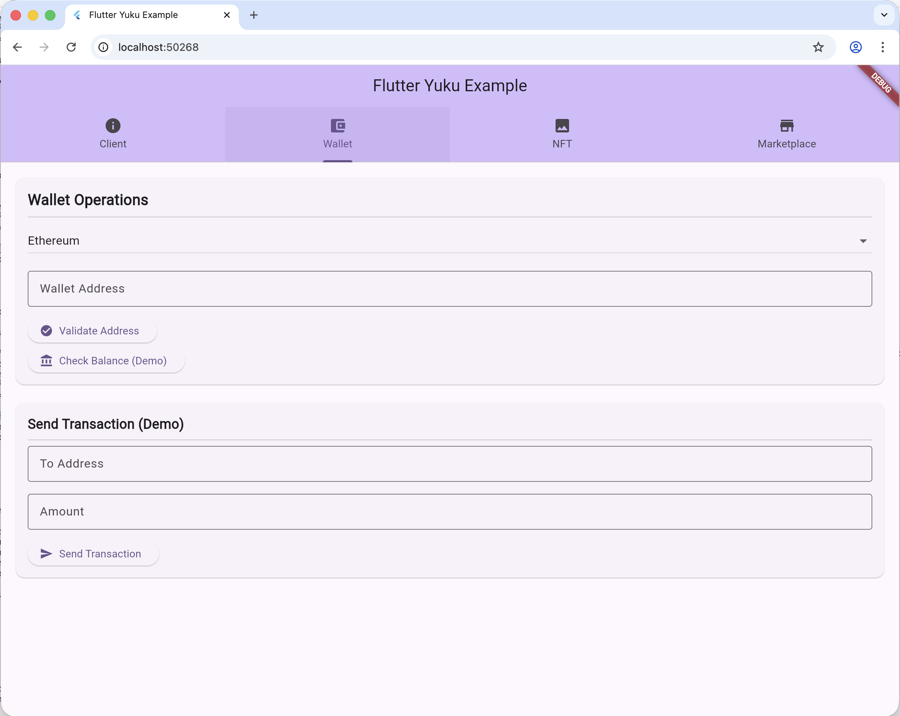
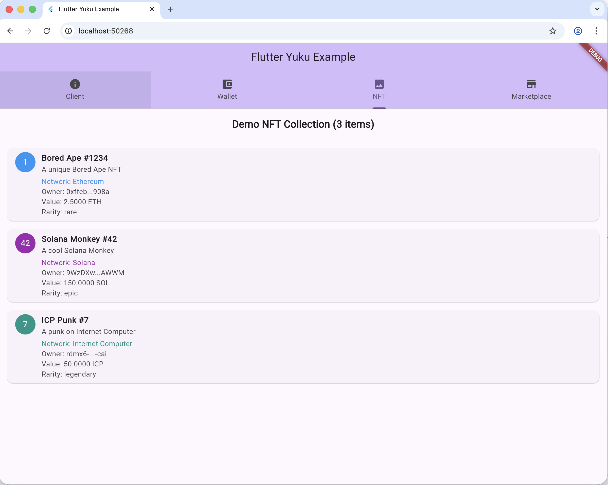
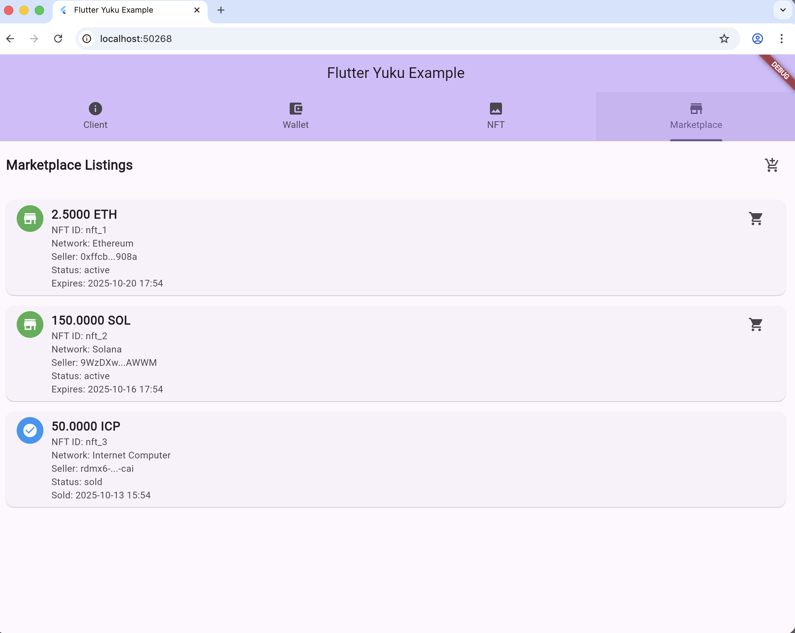

# Flutter Yuku

<div align="center">

### 🌍 [English](README.md) | [Русский](README_ru.md) | [ไทย](README_th.md) | [中文](README_cn.md)

[](https://pub.dev/packages/flutter_yuku)
[](https://opensource.org/licenses/MIT)

</div>

## 📱 Screenshots

<div align="center">
  
  
  
  
</div>

---

Universal Flutter library for blockchain operations across multiple networks. Flutter Yuku provides a unified interface for working with NFTs, wallets, and marketplace operations across different blockchain networks.

## Features

- 🌐 **Multi-Blockchain Support**: Ethereum, Solana, Polygon, BSC, Avalanche, ICP, NEAR, TRON
- 🎨 **NFT Operations**: Mint, transfer, burn, approve, and manage NFTs
- 💰 **Wallet Integration**: Connect and manage wallets across different networks
- 🏪 **Marketplace Support**: List, buy, sell, and manage NFT marketplace operations
- 🔧 **Unified API**: Single interface for all blockchain operations
- 📱 **Flutter Widgets**: Ready-to-use UI components for NFT and wallet operations
- 🛡️ **Type Safety**: Full type safety with Dart's type system
- 🚀 **Performance**: Optimized for mobile and web applications

## Supported Networks

- **Ethereum** - Full ERC-721 and ERC-1155 support
- **Solana** - SPL Token and Metaplex support
- **Polygon** - Layer 2 Ethereum scaling
- **BSC** - Binance Smart Chain
- **Avalanche** - C-Chain support
- **ICP** - Internet Computer Protocol
- **NEAR** - NEAR Protocol
- **TRON** - TRON blockchain

## Installation

Add `flutter_yuku` to your `pubspec.yaml`:

```yaml
dependencies:
  flutter_yuku: ^1.0.0
```

Then run:

```bash
flutter pub get
```

## Quick Start

### 1. Initialize the Client

```dart
import 'package:flutter_yuku/flutter_yuku.dart';

final client = YukuClient();
await client.initialize();
```

### 2. Get NFT Provider

```dart
// Get provider for Ethereum
final ethereumProvider = client.getNFTProvider(BlockchainNetwork.ethereum);

// Get provider for ICP
final icpProvider = client.getNFTProvider(BlockchainNetwork.icp);
```

### 3. Basic NFT Operations

```dart
// Get NFTs owned by an address
final nfts = await ethereumProvider.getNFTsByOwner('0x...');

// Get specific NFT
final nft = await ethereumProvider.getNFT('1', '0x...');

// Mint new NFT
final transactionHash = await ethereumProvider.mintNFT(
  toAddress: '0x...',
  metadata: NFTMetadata(
    name: 'My NFT',
    description: 'A beautiful NFT',
    image: 'https://example.com/image.png',
  ),
  contractAddress: '0x...',
);
```

### 4. Wallet Operations

```dart
// Get wallet provider
final walletProvider = client.getWalletProvider(BlockchainNetwork.ethereum);

// Connect wallet
await walletProvider.connect();

// Get balance
final balance = await walletProvider.getBalance('0x...');

// Send transaction
final txHash = await walletProvider.sendTransaction(
  to: '0x...',
  amount: 0.1,
  currency: 'ETH',
);
```

### 5. Marketplace Operations

```dart
// Get marketplace provider
final marketplaceProvider = client.getMarketplaceProvider(BlockchainNetwork.ethereum);

// List NFT for sale
final listingId = await marketplaceProvider.listNFT(
  tokenId: '1',
  contractAddress: '0x...',
  price: 1.0,
  currency: 'ETH',
);

// Buy NFT
final purchaseTx = await marketplaceProvider.buyNFT(listingId);
```

## Core Components

### YukuClient

The main client that manages all providers and operations.

```dart
final client = YukuClient();

// Initialize with specific providers
await client.initialize();

// Get supported networks
final networks = client.getSupportedNetworks();

// Check if network is supported
final isSupported = client.isNetworkSupported(BlockchainNetwork.ethereum);
```

### NFTProvider

Interface for NFT operations across different blockchains.

```dart
abstract class NFTProvider {
  Future<List<NFT>> getNFTsByOwner(String ownerAddress);
  Future<NFT?> getNFT(String tokenId, String contractAddress);
  Future<String> mintNFT({...});
  Future<String> transferNFT({...});
  Future<String> burnNFT({...});
  // ... more methods
}
```

### WalletProvider

Interface for wallet operations.

```dart
abstract class WalletProvider {
  Future<void> connect();
  Future<void> disconnect();
  Future<double> getBalance(String address);
  Future<String> sendTransaction({...});
  // ... more methods
}
```

### MarketplaceProvider

Interface for marketplace operations.

```dart
abstract class MarketplaceProvider {
  Future<String> listNFT({...});
  Future<String> buyNFT(String listingId);
  Future<String> cancelListing(String listingId);
  Future<List<Listing>> getListings({...});
  // ... more methods
}
```

## Models

### NFT

Universal NFT model that works across all supported networks.

```dart
class NFT {
  final String id;
  final String tokenId;
  final String contractAddress;
  final BlockchainNetwork network;
  final NFTMetadata metadata;
  final String owner;
  final String creator;
  final DateTime createdAt;
  final DateTime updatedAt;
  final String status;
  final double? currentValue;
  final String? valueCurrency;
  final List<String> transactionHistory;
  final Map<String, dynamic> additionalProperties;
}
```

### NFTMetadata

Standardized metadata format.

```dart
class NFTMetadata {
  final String name;
  final String description;
  final String image;
  final Map<String, dynamic> attributes;
  final Map<String, dynamic> properties;
}
```

## Widgets

### YukuWalletWidget

Ready-to-use wallet connection widget.

```dart
YukuWalletWidget(
  onConnected: (address) {
    print('Connected: $address');
  },
  onDisconnected: () {
    print('Disconnected');
  },
)
```

### YukuNFTWidget

Display NFT information.

```dart
YukuNFTWidget(
  nft: nft,
  onTap: () {
    // Handle NFT tap
  },
)
```

### YukuMarketplaceWidget

Marketplace interface widget.

```dart
YukuMarketplaceWidget(
  onNFTSelected: (nft) {
    // Handle NFT selection
  },
  onBuyNFT: (listingId) {
    // Handle NFT purchase
  },
)
```

## Configuration

### Network Configuration

```dart
// Configure Ethereum mainnet
client.setNetworkConfig(
  BlockchainNetwork.ethereum,
  NetworkConfig(
    name: 'Ethereum Mainnet',
    rpcUrl: 'https://mainnet.infura.io/v3/YOUR_KEY',
    chainId: '1',
    network: BlockchainNetwork.ethereum,
    isTestnet: false,
  ),
);

// Configure ICP mainnet
client.setNetworkConfig(
  BlockchainNetwork.icp,
  NetworkConfig(
    name: 'ICP Mainnet',
    rpcUrl: 'https://ic0.app',
    chainId: 'icp',
    network: BlockchainNetwork.icp,
    isTestnet: false,
  ),
);
```

### Provider Configuration

```dart
// Register custom provider
client.registerNFTProvider(CustomNFTProvider());

// Set default provider for network
client.setDefaultProvider(BlockchainNetwork.ethereum, 'custom-provider');
```

## Error Handling

```dart
try {
  final nfts = await provider.getNFTsByOwner(address);
} on NFTOperationException catch (e) {
  print('NFT operation failed: ${e.message}');
} on NetworkException catch (e) {
  print('Network error: ${e.message}');
} catch (e) {
  print('Unexpected error: $e');
}
```

## Examples

See the `example/` directory for complete examples:

- **Basic NFT Operations**: Mint, transfer, and manage NFTs
- **Wallet Integration**: Connect wallets and manage balances
- **Marketplace**: List and buy NFTs
- **Multi-Network**: Work with multiple blockchain networks

## Contributing

We welcome contributions! Please see our [Contributing Guide](CONTRIBUTING.md) for details.

## License

This project is licensed under the MIT License - see the [LICENSE](LICENSE) file for details.

## Support

- 📖 [Documentation](https://github.com/libsFlutter/flutter_yuku/wiki)
- 🐛 [Issue Tracker](https://github.com/libsFlutter/flutter_yuku/issues)
- 💬 [Discussions](https://github.com/libsFlutter/flutter_yuku/discussions)

## Changelog

See [CHANGELOG.md](CHANGELOG.md) for a list of changes and version history.